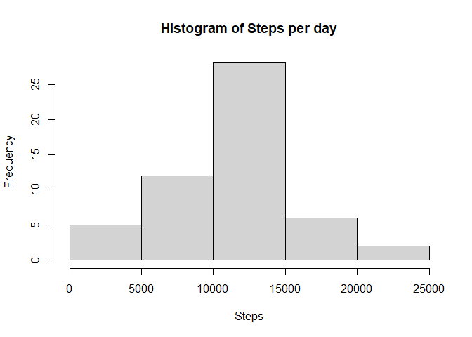

## Loading libraries
To begin, we'll load the used libraries:

```r
library(ggplot2)
library(dplyr)
```

```
## 
## Attaching package: 'dplyr'
```

```
## The following objects are masked from 'package:stats':
## 
##     filter, lag
```

```
## The following objects are masked from 'package:base':
## 
##     intersect, setdiff, setequal, union
```

## Loading and preprocessing the data
First, let's unzip and load the file.

```r
unzip("./activity.zip")
Factivity <- read.csv("./activity.csv")
summary(Factivity)
```

```
##      steps            date              interval     
##  Min.   :  0.00   Length:17568       Min.   :   0.0  
##  1st Qu.:  0.00   Class :character   1st Qu.: 588.8  
##  Median :  0.00   Mode  :character   Median :1177.5  
##  Mean   : 37.38                      Mean   :1177.5  
##  3rd Qu.: 12.00                      3rd Qu.:1766.2  
##  Max.   :806.00                      Max.   :2355.0  
##  NA's   :2304
```
Since the "date" column is a character, let's change it to date! Also, make a pairs plot to see eventual correlations

```r
Factivity$date<- as.Date(Factivity$date,"%Y-%m-%d")
summary(Factivity)
```

```
##      steps             date               interval     
##  Min.   :  0.00   Min.   :2012-10-01   Min.   :   0.0  
##  1st Qu.:  0.00   1st Qu.:2012-10-16   1st Qu.: 588.8  
##  Median :  0.00   Median :2012-10-31   Median :1177.5  
##  Mean   : 37.38   Mean   :2012-10-31   Mean   :1177.5  
##  3rd Qu.: 12.00   3rd Qu.:2012-11-15   3rd Qu.:1766.2  
##  Max.   :806.00   Max.   :2012-11-30   Max.   :2355.0  
##  NA's   :2304
```

```r
pairs(Factivity)
```

<!-- -->

## What is mean total number of steps taken per day?
To calculate the total of steps:

```r
sum(Factivity$steps,na.rm=T)
```

```
## [1] 570608
```
That, however, doesn't show the mean per day. We should use a correlation:

```r
Steps.Day<- aggregate(steps ~ date, Factivity, sum, na.rm=T)
```
Now we can make a histogram of the steps taken per day!

```r
hist(Steps.Day$steps, main="Histogram of Steps per day", xlab="Steps")
```

<!-- -->
To calculate the mean and median steps per day, we can go on two directions. One of them is making each operation one by one:

```r
mediansteps<- median(Steps.Day$steps)
meansteps<- mean(Steps.Day$steps)
mediansteps
```

```
## [1] 10765
```

```r
meansteps
```

```
## [1] 10766.19
```
That way, we've stored the median steps at variable mediansteps and the mean steps per day at the variable meansteps. However, we can use the summary command and it will show those infos and more at once:

```r
options(digits=10) #use this to avoid roundings by R
summary(Steps.Day$steps)
```

```
##     Min.  1st Qu.   Median     Mean  3rd Qu.     Max. 
##    41.00  8841.00 10765.00 10766.19 13294.00 21194.00
```
So, using summary(), we get not only the median and mean, but also the quantiles, min and max values.
## What is the average daily activity pattern?


## Imputing missing values


## Are there differences in activity patterns between weekdays and weekends?
