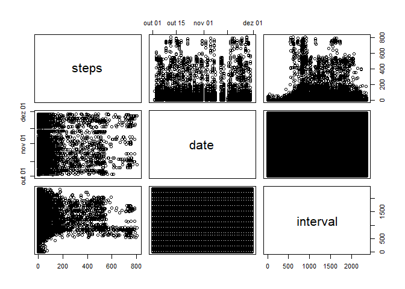

## Loading libraries
To begin, we'll load the used libraries:

```r
library(ggplot2)
library(dplyr)
```

```
## 
## Attaching package: 'dplyr'
```

```
## The following objects are masked from 'package:stats':
## 
##     filter, lag
```

```
## The following objects are masked from 'package:base':
## 
##     intersect, setdiff, setequal, union
```

## Loading and preprocessing the data
First, let's unzip and load the file.

```r
unzip("./activity.zip")
Factivity <- read.csv("./activity.csv")
summary(Factivity)
```

```
##      steps            date              interval     
##  Min.   :  0.00   Length:17568       Min.   :   0.0  
##  1st Qu.:  0.00   Class :character   1st Qu.: 588.8  
##  Median :  0.00   Mode  :character   Median :1177.5  
##  Mean   : 37.38                      Mean   :1177.5  
##  3rd Qu.: 12.00                      3rd Qu.:1766.2  
##  Max.   :806.00                      Max.   :2355.0  
##  NA's   :2304
```
Since the "date" column is a character, let's change it to date! Also, make a pairs plot to see eventual correlations

```r
Factivity$date<- as.Date(Factivity$date,"%Y-%m-%d")
summary(Factivity)
```

```
##      steps             date               interval     
##  Min.   :  0.00   Min.   :2012-10-01   Min.   :   0.0  
##  1st Qu.:  0.00   1st Qu.:2012-10-16   1st Qu.: 588.8  
##  Median :  0.00   Median :2012-10-31   Median :1177.5  
##  Mean   : 37.38   Mean   :2012-10-31   Mean   :1177.5  
##  3rd Qu.: 12.00   3rd Qu.:2012-11-15   3rd Qu.:1766.2  
##  Max.   :806.00   Max.   :2012-11-30   Max.   :2355.0  
##  NA's   :2304
```

```r
pairs(Factivity)
```

<!-- -->

## What is mean total number of steps taken per day?
To calculate the total of steps:

```r
sum(Factivity$steps,na.rm=T)
```

```
## [1] 570608
```
That, however, doesn't show the mean per day. We should use a correlation:

```r
Steps.Day<- aggregate(steps ~ date, Factivity, sum, na.rm=F)
```
Now we can make a histogram of the steps taken per day!

```r
hist(Steps.Day$steps, main="Histogram of Steps per day", xlab="Steps")
```

<!-- -->
To calculate the mean and median steps per day, we can go on two directions. One of them is making each operation one by one:

```r
mediansteps<- median(Steps.Day$steps)
meansteps<- mean(Steps.Day$steps)
mediansteps
```

```
## [1] 10765
```

```r
meansteps
```

```
## [1] 10766.19
```
That way, we've stored the median steps at variable mediansteps and the mean steps per day at the variable meansteps. However, we can use the summary command and it will show those infos and more at once:

```r
options(digits=10) #use this to avoid roundings by R
summary(Steps.Day$steps)
```

```
##     Min.  1st Qu.   Median     Mean  3rd Qu.     Max. 
##    41.00  8841.00 10765.00 10766.19 13294.00 21194.00
```
So, when using summary(), we get not only the median and mean, but also the quantiles, min and max values!

## What is the average daily activity pattern?

To make a line plot, we'll first apply the mean and remove NA, then plot the variable created and name the labels. 

```r
IntervalSteps <- tapply(Factivity$steps,Factivity$interval, mean, na.rm=T)
plot(as.numeric(names(IntervalSteps)),
     IntervalSteps,
     xlab = "interval",
     ylab = "steps",
     main = "Avg daily activity",
     type = "l")
```

<!-- -->
Which 5-minute interval, on average across all the days in the dataset, contains the maximum number of steps?

```r
maxInt <- names(sort(IntervalSteps, decreasing=T)[1])
maxStep<- sort(IntervalSteps, decreasing=T)[1]
maxInt
```

```
## [1] "835"
```

```r
maxStep
```

```
##         835 
## 206.1698113
```
The interval associated with maximum activity is the one numbered 835, with 206.1698113 steps.

## Imputing missing values
1. Calculate and report the total number of missing values in the dataset (i.e. the total number of rows with NAs)

```r
sum(is.na(Factivity$steps))
```

```
## [1] 2304
```
There are 2304 missing values!

So I will fill the missing data with the mean of available steps per dates for that interval, using the IntervalSteps variable created before

```r
Asplit <- split(Factivity, Factivity$interval)
for (i in 1:length(Asplit)){
    Asplit[[i]]$steps[is.na(Asplit[[i]]$steps)] <- IntervalSteps[i]
}
filledActivity<- do.call("rbind",Asplit)
filledActivity<- filledActivity[order(filledActivity$date),]
```
Now let's make a histogram of the total number of steps taken  each day and calculate and report the mean and median:

```r
Steps.Day.Filled <- tapply(filledActivity$steps, filledActivity$date,sum)
hist(Steps.Day.Filled, xlab="Steps",main="Histogram of Steps per Day - filled data")
```

<!-- -->
As before, to calculate the mean:

```r
mean(Steps.Day.Filled,na.rm=T)
```

```
## [1] 10766.18868
```

And to calculate the median:

```r
median(Steps.Day.Filled,na.rm=T)
```

```
## [1] 10766.18868
```
As one can see, those values differ from the ones calculated before, at the first part of the assignment. By filling the NAs with median, that alters the mean and median - it's a presumption done by the analyst

## Are there differences in activity patterns between weekdays and weekends?
First we will create a new factor withh weedays and weekends.

```r
Sys.setlocale("LC_TIME", "English") #change the language to English in for the function to work properly, otherwise it won't filter correctly
```

```
## [1] "English_United States.1252"
```

```r
Days.Act <- Factivity[complete.cases(Factivity),] %>% 
    mutate(Weekday = weekdays(date))%>%
    mutate(Weekend = ifelse(Weekday == "Saturday" | Weekday == "Sunday", "Weekend","Weekday"))
```
Now let's plot Weekdays vs Weekends:

```r
Days.Act %>%
  group_by(Weekend, interval) %>% 
  mutate(meanStepsInterval = mean(steps)) %>%
  ggplot(aes(interval, meanStepsInterval)) + geom_line() +
  facet_wrap(~Weekend) +
  ggtitle("Mean Steps/Interval: Weekdays vs. Weekends") +
  xlab("Interval") +
  ylab("Mean Steps")
```

<!-- -->
At last, we'll create a panel plot with the time series plot of the 5-minute interval(x) and the average number of steps taken, averaged across all weekdays (y)

```r
Days.Act %>%
  group_by(Weekday, interval) %>%
  mutate(meanStepsInterval = mean(steps)) %>%
  ggplot(aes(interval, meanStepsInterval)) + geom_line() +
  facet_wrap(~Weekday) +
  ggtitle("Mean steps by interval per day of the week") +
  xlab("Interval") +
  ylab("Mean Steps")
```

<!-- -->
